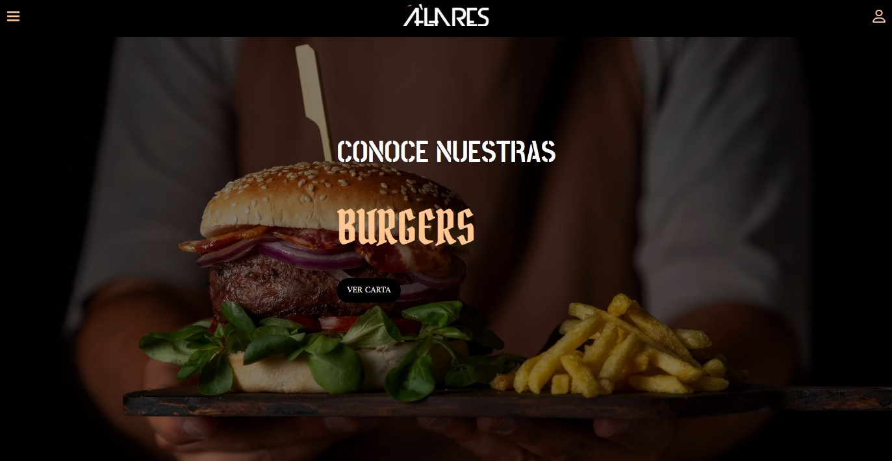

# Alares - Jesús María Bar
Alares is a project that aims to offer a unique experience in the heart of Jesús María as an innovative bar. Committed to providing a cozy atmosphere, excellent drinks, and exceptional service, Alares stands as the ideal place to enjoy special moments with friends and family.

### Features
- User login: Alares provides a secure user login system so that users can access and enjoy personalized features.

- Shopping cart: Customers can explore and add their favorite drinks and meals to a shopping cart, making order management easy.

- Menu view: An intuitive interface showcasing the variety of drinks and meals that Alares offers, allowing customers to easily navigate the menu.

- Top customer ranking: We recognize and reward our most loyal customers through a ranking system that highlights those who frequent Alares.

- Administrator dashboard: A robust administration panel that allows owners and managers to monitor sales, manage inventory, and track business performance.

- Reservation management: We offer our customers the option to reserve tables for special events, ensuring a seamless experience at Alares.

- Orders and inquiries: Customers can place special orders or ask questions directly through the platform, providing smooth and personalized communication.

### Technologies Used
This project was built using a combination of modern technologies to ensure efficient performance and an exceptional user experience:

- HTML, CSS, and JavaScript
- React
- Node.js
- PostgreSQL

### How to Use
Access the Alares website: https://alaresjm.onrender.com from your web browser.
Use this credentials to see admin and customer views:
  - mail: guest@gmail.com
  - pass: Guest_123

### Developer
Alares was developed by [Mauro Ibarra] as a project dedicated to providing a unique experience in Jesús María.

### Follow Us
If you enjoyed your experience at Alares and want to stay updated on future projects, follow us on our social media:

Instagram:  

LinkedIn:   

We appreciate your support and feedback; we hope Alares brings you unforgettable moments!

